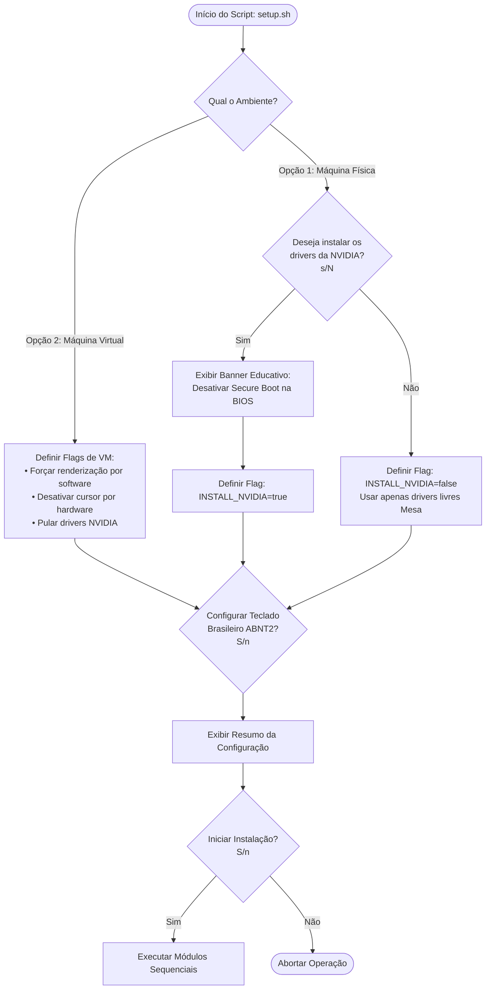

# PLANO DE IMPLEMENTAÇÃO E ESPECIFICAÇÃO TÉCNICA

## Projeto: Fedora Minimal (Netinstall) → Pure Wayland Workstation

**Stack Gráfica:** Umbriel (`umbriel-nightly`) + Noctalia Shell (`noctalia`) + Noctalia Greeter (`greetd`)  

**Público-Alvo:** Desenvolvedor / Modelo de IA Gerador de Código  

**Versão Base Alvo:** Fedora 44 (x86_64)

---

## 1. DIRETRIZES DE ENGENHARIA E ARQUITETURA MODULAR

O script de instalação final **não deve ser construído como um arquivo monolítico**. Ele deve seguir os princípios de **Modularidade, Separação de Preocupações (SoC) e Facilidade de Manutenção**. A adição ou remoção de pacotes deve ser realizada alterando listas estáticas de texto/configuração, sem tocar na lógica do código de execução.

### 1.1 Estrutura de Diretórios Recomendada

O projeto deve ser organizado na seguinte hierarquia:

```text
fedora-noctalia-installer/
├── setup.sh                         # Ponto de entrada: checagens iniciais, menu e orquestração
├── config/
│   ├── packages-base.conf           # Lista de pacotes do sistema (Firmware, Áudio, Portais, XDG)
│   ├── packages-apps.conf           # Lista de aplicações essenciais do usuário
│   ├── packages-nvidia.conf         # Lista da pilha de drivers NVIDIA
│   └── settings.conf                # Variáveis globais (repositórios, versões, flags de ambiente)
├── lib/
│   ├── ui.sh                        # Funções de renderização visual (menu ANSI, banners, cores)
│   ├── logger.sh                    # Registro de logs (/tmp/installer.log) e tratamento de erros
│   └── utils.sh                     # Funções utilitárias (validador de internet, sudo, backups)
├── modules/
│   ├── 00_repos.sh                  # Inclusão e ativação de repositórios (Terra, RPM Fusion, Brave)
│   ├── 01_system_hardware.sh        # Firmware, som (PipeWire), energia (Tuned) e rede
│   ├── 02_display_stack.sh          # Wayland, Greetd, Noctalia Greeter e PAM
│   ├── 03_compositor_shell.sh       # Umbriel, Noctalia Shell, Xwayland-satellite e Portais
│   ├── 04_gpu_drivers.sh            # Drivers gráficos (Mesa livre ou NVIDIA se solicitado)
│   ├── 05_desktop_apps.sh           # Apps de uso diário, codecs multimídia e fontes
│   └── 06_post_install.sh           # Configuração de autostart, atalhos, ABNT2 e targets do systemd
└── templates/
    ├── greetd.toml.template         # Template de configuração do /etc/greetd/config.toml
    ├── pam_greetd.template          # Bloco do pam_gnome_keyring.so para o PAM
    └── flathub.desktop              # Lançador .desktop para o Flathub como WebApp
```

### 1.2 Regras Estritas de Programação Shell

1. **Defensividade:** Todos os módulos devem rodar sob `set -euo pipefail`.

2. **Execução sem Root Direto:** O script deve recusar ser executado diretamente com `sudo ./setup.sh`. Ele deve ser iniciado pelo usuário comum (`./setup.sh`) e invocar `sudo` internamente apenas quando estritamente necessário.

3. **Idempotência:** A reexecução do script (ou de módulos individuais) não deve duplicar linhas em arquivos de configuração (`grep -qF` antes de inserir).

4. **Isolamento de Listas:** Os arquivos `.conf` na pasta `config/` devem conter um pacote por linha, ignorando linhas que comecem com `#` e linhas vazias, permitindo que a IA ou o usuário adicione ou remova softwares apenas comentando uma linha.

---

## 2. DICIONÁRIO TÉCNICO E AUDITORIA DE PACOTES (POR REPOSITÓRIO)

Todos os pacotes a seguir foram auditados e confirmados para a base do **Fedora 44**.

### 2.1 Repositório Oficial do Fedora (fedora & updates)

| Pacote | Função e Importância no Sistema |
| :--- | :--- |
| `noctalia` | **Shell de Desktop:** Interface gráfica nativa em C++/QtQuick baseada no protocolo `wlr-layer-shell`. Fornece barra de status, centro de controle, calendário, notificações e lançador de apps. *(Disponível nativamente no Fedora 44+)*. |
| `xwayland-satellite` | **Servidor X11 Rootless Externo:** Permite que aplicações antigas em X11 rodem de forma transparente e isolada no Umbriel. O Umbriel não embutiu o Xwayland diretamente; ele exige esse executável no PATH. |
| `greetd` | **Gerenciador de Login Minimalista:** Daemon nativo para Wayland que gerencia o console virtual (VT) e executa o Noctalia Greeter. |
| `greetd-selinux` | **Políticas de Segurança do Greetd:** Módulos SELinux necessários para que o `greetd` possa autenticar usuários sem disparar alertas de bloqueio (`denials`). |
| `pipewire` | **Servidor Multimídia Central:** Substituto moderno do PulseAudio/JACK. Gerencia fluxos de áudio e vídeo de baixa latência. |
| `wireplumber` | **Gerenciador de Políticas de Áudio:** Motor de roteamento de sessões do PipeWire (define fones padrão, microfones e controle de volume). |
| `pipewire-pulseaudio` | **Camada de Compatibilidade:** Socket emulador de PulseAudio para que navegadores, jogos e apps legados toquem som no PipeWire. |
| `pipewire-alsa` | **Plugin ALSA:** Redireciona chamadas diretas da camada ALSA para o PipeWire. |
| `NetworkManager-wifi` | **Conectividade Sem Fio:** Submódulo do NetworkManager para escaneamento e conexão a redes Wi-Fi públicas e privadas. |
| `bluez` & `bluez-tools` | **Pilha Bluetooth:** Drivers e utilitários para pareamento e uso de fones, caixas de som, teclados e mouses Bluetooth. |
| `dbus-broker` | **Barramento D-Bus de Alta Performance:** Implementação do barramento de comunicação do sistema, mais rápida e segura que o `dbus-daemon`. |
| `seatd` | **Gerenciador de Assentos (Seat/Sessão):** Fornece permissões de acesso ao hardware de vídeo e teclado para o compositor Wayland sem depender de daemons pesados. |
| `polkit` | **Framework de Autorização:** Gerencia a elevação de privilégios para tarefas administrativas. |
| `mate-polkit` | **Agente Gráfico de Senhas:** Exibe a janelinha gráfica solicitando senha de administrador em sessões Wayland puras (substituto oficial do falecido `polkit-gnome`). |
| `gnome-keyring` & `libsecret` | **Cofre de Chaves e Senhas:** Guarda credenciais de Wi-Fi, chaves SSH e senhas de navegadores com criptografia segura. |
| `xdg-desktop-portal` | **Roteador Central de Portais:** Permite que janelas Wayland comuniquem-se de forma segura com o sistema (caixas de diálogo de abrir/salvar arquivos). |
| `xdg-desktop-portal-gtk` | **Backend de Diálogos GTK:** Renderiza janelas nativas de seleção de arquivos para aplicativos GTK. |
| `xdg-user-dirs` & `xdg-utils` | **Diretórios de Usuário:** Cria as pastas padrões (`Downloads`, `Documentos`, `Imagens`) e fornece o comando `xdg-open`. |
| `linux-firmware` | **Firmwares de Hardware:** Microcódigo para placas Wi-Fi (Intel, Realtek, Atheros), chips Bluetooth e GPUs. |
| `alsa-firmware` | **Firmware de Áudio:** Suporte a controladores de áudio integrados e DSPs de som de notebooks recentes. |
| `intel-microcode` / `amd-ucode-firmware` | **Microcódigo de CPU:** Atualizações de estabilidade e mitigações de segurança para processadores Intel ou AMD. |
| `tuned` & `tuned-ppd` | **Gerenciamento de Energia Moderno:** Padrão do Fedora desde o F41. O `tuned-ppd` intercepta chamadas de perfil de bateria do Noctalia Shell e alterna os modos de energia. |
| `brightnessctl` | **Controle de Iluminação:** Utilitário para ajuste fino de brilho da tela e iluminação do teclado retroiluminado. |
| `upower` | **Monitor de Bateria:** Monitora o consumo de energia, percentual de carga e saúde da bateria do notebook. |
| `libinput` & `libinput-utils` | **Tratamento de Entrada:** Suporte a touchpads multitoque (gestos de pinça, rolagem com dois dedos e tap-to-click). |
| `switcheroo-control` | **GPU Híbrida (PRIME):** Daemon D-Bus que permite disparar jogos ou navegadores na placa dedicada NVIDIA sob demanda. |
| `cups`, `cups-filters`, `ipp-usb` | **Impressão Universal Sem Driver:** Implementa o protocolo IPP Everywhere / Mopria. Detecta e imprime em 95% das impressoras modernas USB e Wi-Fi sem instalar drivers de CD. |
| `sane-backends`, `sane-airscan` | **Digitalização Sem Driver:** Suporte universal para scanners USB e scanners de rede via protocolos eSCL e WSD. |
| `simple-scan` | **App de Scanner:** Interface visual simples para digitalizar documentos em PDF ou imagem. |
| `nautilus` | **Gerenciador de Arquivos:** Aplicação moderna em GTK4 para gerenciar arquivos, pastas e discos. |
| `gvfs-mtp`, `gvfs-smb`, `gvfs-archive`, `gvfs-fuse` | **Módulos do Sistema de Arquivos:** Conexão com celulares Android (MTP), pastas compartilhadas de rede Windows (Samba), navegação em arquivos compactados e integração FUSE. |
| `loupe` | **Visualizador de Imagens:** Visualizador moderno em GTK4. Extremamente rápido e seguro. |
| `evince` | **Visualizador de Documentos:** Leitor leve e confiável para arquivos PDF e PostScript. |
| `gnome-text-editor` | **Editor de Texto:** Substituto moderno do Gedit para notas e arquivos de configuração. |
| `file-roller` & `file-roller-nautilus` | **Compactador Gráfico:** Interface para manipular arquivos compactados e adicionar a opção "Extrair Aqui" no menu de clique direito do Nautilus. |
| `celluloid` | **Player Multimídia:** Interface GTK limpa baseada no motor MPV. Executa qualquer arquivo de vídeo ou áudio sem travamentos. |
| `kitty` | **Terminal Acelerado por GPU:** Emulador de terminal padrão, associado de fábrica ao atalho `Mod+Enter` no Umbriel. |
| `gnome-disk-utility` | **Gerenciador de Discos:** Utilitário visual para formatar pendrives, criar partições e gravar arquivos `.iso`. |
| `swaylock` | **Bloqueador de Tela Wayland:** Bloqueia a sessão de forma segura usando o protocolo oficial `ext-session-lock-v1`. |
| `grim`, `slurp`, `wl-clipboard` | **Captura de Tela:** O trio definitivo do Wayland. O `grim` captura a imagem, o `slurp` permite arrastar e selecionar uma área, e o `wl-clipboard` copia para a memória para colar direto no navegador/chat. |
| `playerctl` | **Controle Multimídia (MPRIS):** Utilitário de linha de comando para controlar reprodutores de áudio e vídeo (Spotify, navegadores, Celluloid) através das teclas Play/Pause, Próxima e Anterior. |
| `adwaita-icon-theme` | **Ícones do Sistema:** Pacote oficial que evita ícones quebrados ou invisíveis nas pastas do Nautilus. |
| `google-noto-*-fonts` | **Tipografia Completa:** Famílias Noto Sans, Serif, CJK (caracteres asiáticos) e Color Emoji para evitar blocos vazios na web. |
| `glycin-thumbnailer` | **Miniaturas em Sandbox:** Gera miniaturas seguras de imagens WebP, AVIF, SVG, JPEG-XL no Nautilus. |
| `ffmpegthumbnailer` | **Miniaturas de Vídeo:** Gera prévias dos vídeos (MP4, MKV, AVI, MOV) direto nas pastas do Nautilus. |
| `evince-thumbnailer` | **Miniaturas de Documentos:** Gera a prévia visual da primeira página de arquivos PDF no gerenciador de arquivos. |
| `flatpak` | **Gerenciador de Apps Isolados:** Permite instalar pacotes universais do Flathub sem sujar o sistema base. |

### 2.2 Repositório RPM Fusion Free

| Pacote | Função e Importância no Sistema |
| :--- | :--- |
| `ffmpeg` | **Suíte Multimídia Completa:** Substitui o `ffmpeg-free` capado. Traz decodificação e codificação irrestrita de áudio e vídeo por software e hardware. |
| `gstreamer1-plugins-bad-freeworld` | **Plugins Multimídia Restritos:** Adiciona codecs proprietários de alta performance ao pipeline GStreamer do sistema. |
| `gstreamer1-plugins-ugly` | **Codecs Adicionais:** Suporte a formatos multimídia antigos ou protegidos por patentes comerciais. |
| `mesa-va-drivers-freeworld` | **Aceleração VA-API da Mesa:** Permite que GPUs AMD e Intel façam decodificação de vídeos H.264/H.265 na placa gráfica em vez de sobrecarregar a CPU. |

### 2.3 Repositório RPM Fusion Nonfree

| Pacote | Função e Importância no Sistema |
| :--- | :--- |
| `unrar` | **Descompactador RAR Real:** Utilitário oficial proprietário da RARLAB capaz de extrair arquivos RAR criptografados e modernos (o pacote `unrar-free` básico da base falha nesses arquivos). |
| `akmod-nvidia` | **Módulo do Kernel NVIDIA:** Compila automaticamente o driver proprietário oficial da NVIDIA para o seu kernel a cada atualização do sistema. *(Apenas para Máquina Física)*. |
| `xorg-x11-drv-nvidia-cuda` | **Bibliotecas CUDA:** Suporte para aceleração de inteligência artificial, renderização 3D e softwares que exigem computação CUDA na GPU NVIDIA. |
| `xorg-x11-drv-nvidia-power` | **Gerenciamento de Energia da NVIDIA:** Habilita os serviços para suspender, hibernar e desligar a placa dedicada quando não estiver em uso (PCIe RTD3). |
| `libva-nvidia-driver` | **Ponte VA-API para NVDEC:** Permite que navegadores web (Brave, Firefox) utilizem os chips NVDEC da placa NVIDIA para decodificar vídeos do YouTube em 4K/60fps com consumo mínimo de bateria. |

### 2.4 Repositório Terra (Fyra Labs)

| Pacote | Função e Importância no Sistema |
| :--- | :--- |
| `terra-release` & `terra-gpg-keys` | **Arquivos do Repositório Terra:** Configura as URLs de espelhos e chaves criptográficas do ecossistema Fyra Labs. |
| `umbriel-nightly` | **Compositor Wayland Dinâmico:** Compositor leve construído em C++23 sobre o `wlroots`. Gerencia as janelas, foco, monitores e atalhos de teclado. *(No Fedora, o Terra só distribui builds na branch `nightly`)*. |
| `noctalia-greeter` | **Tela de Login Gráfica:** Aplicação gráfica moderna feita sob medida para rodar sobre o `greetd`, combinando com a identidade visual do Noctalia. |
| `xdg-desktop-portal-umbriel-nightly` | **Backend de Portal do Umbriel:** Permite compartilhamento de janelas e gravação de tela nativa no compositor Umbriel. |

### 2.5 Repositório Oficial Brave Software

| Pacote | Função e Importância no Sistema |
| :--- | :--- |
| `brave-origin` | **Navegador Web Minimalista Oficial:** Versão do Brave empacotada oficialmente pela Brave Software sem IA (Leo), sem carteira de criptomoedas e sem telemetria. Mantém apenas o bloqueador de anúncios e o motor Chromium (gratuito no Linux). |

---

## 3. DESIGN VISUAL DO MENU INTERATIVO CLI (ANSI/ASCII)

O script deve apresentar uma interface em linha de comando elegante, padronizada e moderna utilizando caracteres Unicode e códigos de escape ANSI.

### 3.1 Mockup da Interface Principal

```text
  ███████╗███████╗██████╗  ██████╗ ██████╗  █████╗ 
  ██╔════╝██╔════╝██╔══██╗██╔═══██╗██╔══██╗██╔══██╗
  █████╗  █████╗  ██║  ██║██║   ██║██████╔╝███████║
  ██╔══╝  ██╔══╝  ██║  ██║██║   ██║██╔══██╗██╔══██║
  ██║     ███████╗██████╔╝╚██████╔╝██║  ██║██║  ██║
  ╚═╝     ╚══════╝╚═════╝  ╚═════╝ ╚═╝  ╚═╝╚═╝  ╚═╝
  ── Umbriel + Noctalia Shell + Noctalia Greeter ──
  Fedora 44 Minimal | Pure Wayland | Out-of-the-box
  ┌─────────────────────────────────────────────────────────┐
  │ [1] SELEÇÃO DO AMBIENTE DE INSTALAÇÃO                   │
  └─────────────────────────────────────────────────────────┘
  Por favor, informe a plataforma onde o sistema irá rodar:
    [1] Máquina Física (Bare Metal / Notebook / PC)
    [2] Máquina Virtual (VMware / VirtualBox)
  Escolha uma opção [1-2] (Padrão: 1): _
```

### 3.2 Cores e Estilo de Log Padronizados

* **Cabeçalho:** Ciano em Negrito (`\e[1;36m`)

* **Sucesso / OK:** Verde (`\e[1;32m [OK]\e[0m`)

* **Aviso / Atenção:** Amarelo (`\e[1;33m [AVISO]\e[0m`)

* **Erro Crítico:** Vermelho (`\e[1;31m [ERRO]\e[0m`)

* **Informação / Ação:** Azul (`\e[1;34m [INFO]\e[0m`)

---

## 4. ÁRVORE DE DECISÃO E LÓGICA CONDICIONAL DO MENU

A IA deve programar o fluxo de perguntas seguindo estritamente as decisões definidas:



### 4.1 O Banner Educativo do Secure Boot (Exibição Obrigatória se NVIDIA = Sim)

Se o usuário na máquina física optar por instalar a NVIDIA, o terminal **deve pausar e imprimir com destaque**:

```text
  ╔═════════════════════════════════════════════════════════════════════╗
  ║ ⚠️  AVISO CRÍTICO DE HARDWARE: SECURE BOOT NA BIOS                  ║
  ╚═════════════════════════════════════════════════════════════════════╝
   Os drivers proprietários da NVIDIA são compilados diretamente no seu
   computador pelo serviço 'akmods' para se integrarem ao kernel Linux.
   Com o SECURE BOOT ATIVADO na placa-mãe, o kernel do Fedora bloqueia
   o carregamento desses módulos compilados localmente por falta de 
   assinatura digital de fábrica. Isso causará TELA PRETA no boot.
   RECOMENDAÇÃO:
   Reinicie o computador, acesse a BIOS/UEFI e DESATIVE o Secure Boot
   antes de reiniciar no ambiente gráfico final.
  ───────────────────────────────────────────────────────────────────────
  Pressione [ENTER] para confirmar que está ciente e prosseguir...
```

---

## 5. ESPECIFICAÇÃO TÉCNICA DETALHADA DOS MÓDULOS

A IA geradora deve estruturar a execução dos scripts nos seguintes passos lógicos e sequenciais:

### Módulo 00: Repositórios (`00_repos.sh`)

1. **RPM Fusion Free e Nonfree:**

   ```bash
   sudo dnf install -y \
     "https://mirrors.rpmfusion.org/free/fedora/rpmfusion-free-release-$(rpm -E %fedora).noarch.rpm" \
     "https://mirrors.rpmfusion.org/nonfree/fedora/rpmfusion-nonfree-release-$(rpm -E %fedora).noarch.rpm"
   ```

2. **Repositório Terra (Fyra Labs) com GPG Keys:**

   ```bash
   sudo dnf install -y --nogpgcheck \
     --repofrompath "terra,https://repos.fyralabs.com/terra\$releasever" terra-release terra-gpg-keys
   ```

3. **Repositório Brave Software:**

   ```bash
   sudo dnf install -y dnf-plugins-core
   sudo dnf config-manager addrepo --from-repofile=https://brave-browser-rpm-release.s3.brave.com/brave-browser.repo
   ```

4. **Flathub Oficial:**

   ```bash
   sudo dnf install -y flatpak
   flatpak remote-add --if-not-exists flathub https://dl.flathub.org/repo/flathub.flatpakrepo
   ```

5. **Atualização de Cache:** `sudo dnf upgrade --refresh -y`.

---

### Módulo 01: Infraestrutura de Hardware e Áudio (`01_system_hardware.sh`)

1. Instalar firmwares do kernel e microcódigo detectado:

   * Ler `/proc/cpuinfo`. Se Intel: `intel-microcode`. Se AMD: `amd-ucode-firmware`.

   * Instalar `linux-firmware` e `alsa-firmware`.

2. Instalar utilitários de notebook e energia:

   * `tuned`, `tuned-ppd`, `upower`, `brightnessctl`, `libinput`, `libinput-utils`.

   * Ativar o serviço de perfil de energia: `sudo systemctl enable --now tuned.service`.

3. Instalar infraestrutura de som, rede e segurança:

   * `pipewire`, `wireplumber`, `pipewire-pulseaudio`, `pipewire-alsa`, `NetworkManager-wifi`, `bluez`, `bluez-tools`, `seatd`, `dbus-broker`.

   * `cups`, `cups-filters`, `ipp-usb`, `sane-backends`, `sane-airscan`.

   * Ativar serviços essenciais:

     ```bash
     sudo systemctl enable --now NetworkManager.service bluetooth.service cups.service avahi-daemon.service
     ```

---

### Módulo 02: Drivers Gráficos e GPU (`02_gpu_drivers.sh`)

* **Drivers Abertos (Base para todas as máquinas):**

  * `mesa-dri-drivers`, `mesa-vulkan-drivers`, `mesa-va-drivers-freeworld`, `libva-utils`, `switcheroo-control`.

  * Ativar o `switcheroo-control.service`.

* **Ramo Condicional NVIDIA (Se selecionado pelo usuário na máquina física):**

  * Instalar: `kernel-devel`, `kernel-headers`, `akmods`, `akmod-nvidia`, `xorg-x11-drv-nvidia-cuda`, `xorg-x11-drv-nvidia-power`, `libva-nvidia-driver`.

  * Ativar serviços de preservação de memória e suspensão:

    ```bash
    sudo systemctl enable nvidia-suspend.service nvidia-resume.service nvidia-hibernate.service
    ```

---

### Módulo 03: Pilha do Display Manager e Login (`03_display_stack.sh`)

1. Instalar: `greetd`, `greetd-selinux`, `noctalia-greeter`.

2. **Correção do Usuário no Fedora (Crítico):**

   * O arquivo `/etc/greetd/config.toml` deve ser escrito configurando obrigatoriamente `user = "greetd"` (o usuário `greeter` **não existe** no Fedora).

3. **Ramificação do Comando da Sessão no Greetd:**

   * **Se Máquina Física:**

     ```toml
     [terminal]
     vt = 1
     [default_session]
     command = "/usr/bin/noctalia-greeter-session"
     user = "greetd"
     ```

   * **Se Máquina Virtual:**

     ```toml
     [terminal]
     vt = 1
     [default_session]
     command = "env LIBGL_ALWAYS_SOFTWARE=1 WLR_NO_HARDWARE_CURSORS=1 /usr/bin/noctalia-greeter-session"
     user = "greetd"
     ```

4. **Configuração do PAM para Desbloqueio do Chaveiro de Senhas (`pam_gnome_keyring`):**

   Garantir que o arquivo `/etc/pam.d/greetd` contenha as linhas para que o Brave e o Wi-Fi não peçam senha ao abrir:

   * Na seção `auth`: `auth optional pam_gnome_keyring.so`

   * Na seção `session`: `session optional pam_gnome_keyring.so auto_start`

---

### Módulo 04: Compositor, Shell e Portais (`04_compositor_shell.sh`)

1. Instalar os componentes centrais:

   * `umbriel-nightly` (Compositor via Terra)

   * `noctalia` (Desktop Shell via Fedora Oficial)

   * `xwayland-satellite` (Suporte X11 via Fedora Oficial)

   * `xdg-desktop-portal`, `xdg-desktop-portal-gtk`, `xdg-desktop-portal-umbriel-nightly`.

   * `polkit`, `mate-polkit`, `gnome-keyring`, `libsecret`.

   * `swaylock` (Bloqueador de tela).

---

### Módulo 05: Aplicações de Usuário e Multimídia (`05_desktop_apps.sh`)

1. **Substituição Limpa do FFmpeg (Prevenção de Conflitos de Biblioteca):**
   * Realizar o swap antes de instalar os pacotes para evitar travamentos do DNF com `libswresample-free`:
     ```bash
     sudo dnf swap -y --allowerasing ffmpeg-free ffmpeg
     ```
   * Utilizar a flag `--allowerasing` nas chamadas do DNF deste módulo.

2. **Instalar os programas de uso diário aprovados:**
   * Produtividade: `kitty`, `nautilus`, `loupe`, `evince`, `gnome-text-editor`, `file-roller`, `file-roller-nautilus`, `celluloid`, `simple-scan`, `gnome-disk-utility`.
   * Captura de tela e controle multimídia: `grim`, `slurp`, `wl-clipboard`, `playerctl`.
   * Arquivos compactados: `p7zip`, `p7zip-plugins`, `unrar`, `zstd`, `tar`, `xz`, `unzip`.
   * Miniaturas: `glycin-thumbnailer`, `ffmpegthumbnailer`, `evince-thumbnailer`.
   * Fontes e Ícones: `adwaita-icon-theme`, `google-noto-sans-fonts`, `google-noto-serif-fonts`, `google-noto-sans-cjk-fonts`, `google-noto-color-emoji-fonts`.

3. **Instalação do Brave Origin (com contingência):**
   * Tentar via DNF: `sudo dnf install -y --allowerasing brave-origin`
   * Se retornar erro: executar `curl -fsS https://dl.brave.com/install.sh | FLAVOR=origin sh`

4. **Criação da WebApp do Flathub (0 MB RAM em background):**
   * Criar o arquivo `/usr/share/applications/flathub-store.desktop`:
     ```ini
     [Desktop Entry]
     Name=Loja de Aplicativos (Flathub)
     Comment=Explore e instale aplicativos Flatpak
     Exec=brave-origin --app=https://flathub.org
     Icon=package-x-generic
     Terminal=false
     Type=Application
     Categories=System;PackageManager;
     ```

---

### Módulo 06: Pós-Instalação, Atalhos e Ajustes Finais (`06_post_install.sh`)

1. **Pré-criação do Chaveiro GNOME Keyring (Sem Diálogos Pop-up):**
   * Criar o ponteiro do chaveiro padrão antes do primeiro login gráfico:
     ```bash
     KEYRINGS_DIR="${REAL_HOME}/.local/share/keyrings"
     sudo -u "${REAL_USER}" mkdir -p "${KEYRINGS_DIR}"
     echo "login" | sudo -u "${REAL_USER}" tee "${KEYRINGS_DIR}/default" >/dev/null
     sudo chmod 700 "${KEYRINGS_DIR}"
     sudo chmod 600 "${KEYRINGS_DIR}/default"
     ```

2. **Configuração Base Oficial do Umbriel (`~/.config/umbriel/config.toml`):**
   * Copiar obrigatoriamente a base oficial do sistema para preservar centenas de regras nativas de janelas/tiling:
     ```bash
     cp /usr/share/umbriel/config.toml ~/.config/umbriel/config.toml
     ```

3. **Injeção de Autostart e Hardware (Física vs. Máquina Virtual):**
   * **Se Máquina Física:**
     ```toml
     [general]
     autostart = [
         "noctalia",
         "/usr/libexec/polkit-mate-authentication-agent-1"
     ]
     ```
   * **Se Máquina Virtual:**
     ```toml
     [general]
     autostart = [
         "env LIBGL_ALWAYS_SOFTWARE=1 noctalia",
         "/usr/libexec/polkit-mate-authentication-agent-1"
     ]

     [input.cursor]
     hardware_cursor = false
     ```

4. **Injeção de Layout ABNT2 (Se selecionado pelo usuário no menu):**
   ```toml
   [input.keyboard]
   layout = "br"
   ```

5. **Injeção de Atalhos sob `[keybinds]` antes da Seção `[layout]`:**
   * Os atalhos personalizados devem ser inseridos imediatamente **antes da seção `[layout]`** (~linha 482 do arquivo base) usando a sintaxe nativa direta `"TECLA" = "spawn:COMANDO"`:
     ```toml
     # ------------------------------------------------------------------------------
     # Atalhos Personalizados Fedora Noctalia (Multimídia, Brilho, Print e Bloqueio)
     # ------------------------------------------------------------------------------
     "XF86AudioRaiseVolume" = "spawn:wpctl set-volume @DEFAULT_AUDIO_SINK@ 5%+"
     "XF86AudioLowerVolume" = "spawn:wpctl set-volume @DEFAULT_AUDIO_SINK@ 5%-"
     "XF86AudioMute" = "spawn:wpctl set-mute @DEFAULT_AUDIO_SINK@ toggle"
     "XF86AudioPlay" = "spawn:playerctl play-pause"
     "XF86AudioNext" = "spawn:playerctl next"
     "XF86AudioPrev" = "spawn:playerctl previous"
     "XF86MonBrightnessUp" = "spawn:brightnessctl set 5%+"
     "XF86MonBrightnessDown" = "spawn:brightnessctl set 5%-"
     "Print" = 'spawn:grim -g "$(slurp)" - | wl-copy'
     "Mod+L" = "spawn:swaylock -c 000000"
     ```
   * **Proteção de Heredoc:** Ao gerar ou modificar o arquivo via Python/Bash, utilizar heredoc com aspas (`<<'PYEOF'`) e aspas simples no comando do PrintScreen (`'spawn:grim -g "$(slurp)" - | wl-copy'`) para evitar expansão prematura da variável `$(slurp)` pelo shell.

6. **Renomear a Sessão no Display Manager para "Noctalia":**
   * Editar `/usr/share/wayland-sessions/umbriel.desktop` e definir `Name=Noctalia`.

7. **Criação das Pastas Padrões:**
   * Executar `sudo -u "$REAL_USER" xdg-user-dirs-update`.

8. **Compilação da NVIDIA (Apenas se instalado na máquina física):**
   * Rodar `sudo akmods --force` para garantir que o binário `.ko` seja construído antes do reboot.

9. **Definição de Alvo Gráfico e Substituição do GDM:**
   ```bash
   sudo systemctl disable gdm 2>/dev/null || true
   sudo systemctl enable greetd.service
   sudo systemctl set-default graphical.target
   ```

---

## 6. CRITÉRIOS DE TESTE E VALIDAÇÃO (CHECKLIST PARA A IA)

A IA que escrever o script deve fornecer testes internos de integridade que validem os seguintes itens antes de permitir o reboot:

- [ ] **Validação do Greetd:** Testar se o arquivo `/etc/greetd/config.toml` foi escrito com `user = "greetd"` e verificar se o binário apontado no `command` existe no disco.
- [ ] **Validação do Polkit:** Confirmar que `/usr/libexec/polkit-mate-authentication-agent-1` existe no caminho correto.
- [ ] **Validação do Umbriel:** Checar a sintaxe TOML de `~/.config/umbriel/config.toml` com `tomllib.loads()`.
- [ ] **Validação de Permissões:** Garantir que os diretórios `~/.config` e `~/.local` pertençam ao usuário real (`chown -R $USER:$USER`), e não ao `root`.
- [ ] **Validação de Driver na VM:** Assegurar que nenhuma tentativa de compilar `akmod-nvidia` seja disparada se a opção "Máquina Virtual" foi a escolhida.

---

## 7. DOCUMENTAÇÃO ADICIONAL PARA O README (SEÇÃO GUEST AGENTS)

O script ou o arquivo `README.md` gerado deve incluir a seguinte seção explicativa:

> ### 📌 Nota para Instalação em Máquinas Virtuais (VMware / VirtualBox)
> Se você optar por testar esta instalação a partir da mídia **Fedora Everything Netinstall** dentro de uma Máquina Virtual:
> * Na tela de seleção de pacotes do Anaconda, **marque a opção `Guest Agents`**.
> * **Por que isso é necessário?** O pacote instala o `open-vm-tools` (para VMware) ou módulos de integração do VirtualBox, garantindo:
>   1. Redimensionamento automático da resolução ao maximizar a janela.
>   2. Compartilhamento fluido da área de transferência (Copiar e Colar entre o hospedeiro e a VM).
>   3. Captura e liberação perfeita do ponteiro do mouse sem travamentos na janela.
> *(Em instalações físicas em notebooks ou desktops reais, mantenha `Guest Agents` desmarcado).*

---

## 8. CASOS DE BORDA E ARMADILHAS EVITADAS (SOLUÇÕES VALIDADAS EM TESTE)

Abaixo está o registro técnico consolidado de todos os comportamentos inesperados identificados em testes reais e as soluções definitivas integradas:

| Armadilha / Desafio Técnico | Causa Raiz Identificada | Solução Arquitetural Validada |
| :--- | :--- | :--- |
| **`playerctl` ausente** | Teclas multimídia Play/Pause, Next e Prev não funcionavam por falta de daemon MPRIS CLI. | Adicionado o pacote `playerctl` em `config/packages-apps.conf`. |
| **Atalhos do Umbriel** | Uso de sintaxe inválida (`[[bindings]]` com dicionários) que gerava avisos de chave desconhecida. | Injeção sob `[keybinds]` com a sintaxe `"TECLA" = "spawn:CMD"` imediatamente antes da seção `[layout]`. |
| **Bash Heredoc no PrintScreen** | O shell interpretava `$(slurp)` durante a execução do script e gravava comando vazio no TOML. | Uso estrito de heredoc Python com aspas (`<<'PYEOF'`) e aspas simples literais no comando do PrintScreen. |
| **Conflito FFmpeg** | DNF abortava devido a conflito entre `libswresample-free` da base e pacotes irrestritos do RPM Fusion. | Execução de `dnf swap -y --allowerasing ffmpeg-free ffmpeg` e uso da flag `--allowerasing`. |
| **Flatpak Polkit Prompt** | Chamada do Flatpak sem privilégios disparava pedido interativo de senha no terminal (`org.freedesktop.Flatpak.configure-remote`). | Execução com `sudo flatpak remote-add --if-not-exists flathub ...`. |
| **Idempotência do Repositório Terra** | Reexecução do módulo tentava recriar repositório com o mesmo ID gerando erro no DNF5. | Verificação de segurança prévia com `if ! rpm -q terra-release &>/dev/null && [ ! -f /etc/yum.repos.d/terra.repo ]`. |
| **Escopo de Variáveis (`IS_VM`)** | Execução de `source config/settings.conf` dentro dos módulos resetava variáveis exportadas pelo `setup.sh`. | Uso de `export` explícito no `setup.sh` e expansão padrão `: "${IS_VM:=false}"` no `settings.conf`. |
| **Isolamento de Máquina Virtual** | Módulo de GPU tentava configurar `switcheroo-control` e VA-API dedicados na VM. | Saída antecipada limpa (`return 0`) no início de `02_gpu_drivers.sh` quando `IS_VM=true`. |
| **Display Manager em VM (Greetd)** | Usuário `greetd` não possuía acesso ao hardware de vídeo resultando em tela preta no boot. | Atribuição dos grupos `video,render,input` ao usuário `greetd` e flags de renderização por software (`LIBGL_ALWAYS_SOFTWARE=1`). |
| **Chaveiro GNOME Keyring** | Diálogo "Choose password for new keyring" exibido no primeiro boot. | Inicialização prévia de `${REAL_HOME}/.local/share/keyrings/default` apontando para `login` com permissão `700/600`. |

---

## 9. ESCOPO DE VERSÃO E COMPATIBILIDADE FUTURA

### 9.1 Versão Mínima Suportada: Fedora 44 (Estrita)

O suporte começa **exclusivamente no Fedora 44** pelos seguintes motivos técnicos objetivos:

* O pacote `noctalia` (shell gráfico C++/QtQuick) foi admitido nos repositórios oficiais do Fedora **a partir da versão 44**. Em Fedora 43 ou inferior, o pacote simplesmente não existe no índice do DNF — nenhum COPR legado ou build manual pode substituí-lo de forma equivalente.
* O `umbriel-nightly` depende de versões de biblioteca (`libwlroots`, Qt6 Wayland) que atingiram maturidade suficiente no ciclo F44.
* O DNF5 (substituto definitivo do DNF4) foi promovido a componente padrão a partir do F41, mas a API de resolução de `$releasever` via `dnf config-manager` que o módulo `00_repos.sh` utiliza está estável e testada somente a partir do F44.

**Qualquer IA ou desenvolvedor que tente retroportar este instalador para versões anteriores deve desconsiderar completamente esta especificação** — a falta dos pacotes-chave torna o processo de retroporte inviável sem mudanças arquiteturais profundas.

### 9.2 Forward Compatibility: Design Auto-Adaptativo

O instalador foi deliberadamente projetado para **não envelhecer** ao avançar pelas versões futuras do Fedora. Os mecanismos de auto-adaptação são:

| Componente | Mecanismo | Comportamento |
| :--- | :--- | :--- |
| Espelhos RPM Fusion | `$(rpm -E %fedora)` | Expande para o número da versão em runtime (ex: `44`, `45`, `46`…) |
| Repositório Terra | `$releasever` | Resolvido nativamente pelo DNF5 sem hardcode |
| Pacotes do sistema | Resolução de dependências DNF5 | Versões atuais são sempre selecionadas automaticamente |
| `packages-base.conf` / `packages-apps.conf` | Listas de nomes de pacotes (sem pin de versão) | Sempre instala a versão mais recente disponível |

**Nenhuma linha de código dos módulos precisa ser editada** para suportar o Fedora 45, 46 ou versões superiores — desde que os pacotes `noctalia` e `umbriel-nightly` continuem disponíveis nos repositórios officiais e no Terra.

---

## 10. ARQUITETURA DO SUBSISTEMA DE CREDENCIAIS

### 10.1 Estado Atual: `gnome-keyring` + PAM (Fedora 44)

A instalação mínima do Fedora (Netinstall/Everything) **não inclui nenhum provedor de Secrets Service por padrão**. O módulo `06_post_install.sh` implementa a inicialização do subsistema da seguinte forma:

**Pacotes instalados pelo módulo `01_system_hardware.sh` ou `03_display_stack.sh`:**
- `gnome-keyring` — daemon que implementa o protocolo D-Bus `org.freedesktop.Secrets`.
- `gnome-keyring-pam` — módulo PAM que inicializa o daemon no momento do login.

**Configuração PAM (`/etc/pam.d/greetd`):**
```
auth     optional  pam_gnome_keyring.so
session  optional  pam_gnome_keyring.so  auto_start
```
Isso garante que o daemon seja iniciado automaticamente com a sessão do `greetd` e que o chaveiro seja desbloqueado pela senha do usuário sem nenhuma interação extra.

**Pré-inicialização do diretório de keyrings (`06_post_install.sh`):**
```bash
KEYRINGS_DIR="${REAL_HOME}/.local/share/keyrings"
sudo -u "${REAL_USER}" mkdir -p "${KEYRINGS_DIR}"
echo "login" | sudo -u "${REAL_USER}" tee "${KEYRINGS_DIR}/default" >/dev/null
chmod 700 "${KEYRINGS_DIR}"
```
O ponteiro `default` informa ao `gnome-keyring` qual chaveiro deve ser desbloqueado automaticamente no login. Sem esse arquivo, o GNOME Keyring exibe o diálogo *"Choose password for new keyring"* no primeiro boot — **armadilha eliminada definitivamente por esta pré-inicialização**.

### 10.2 Roadmap Futuro: Migração para `oo7`

O `oo7` é uma implementação do **Secrets Service Provider** em Rust, desenvolvido pela equipe da Fyra Labs como substituto moderno e leve do `gnome-keyring` no ecossistema Noctalia. Quando o pacote estiver disponível e estável nos repositórios Terra ou Fedora oficiais:

1. Substituir `gnome-keyring` + `gnome-keyring-pam` por `oo7` nos módulos de instalação.
2. Avaliar se o protocolo D-Bus exposto é 100% compatível com `libsecret` (consumido por aplicações como o Brave, Git Credential Manager etc.).
3. Adaptar o bloco PAM para o mecanismo de desbloqueio nativo do `oo7`.

**Enquanto a migração não ocorre, o `gnome-keyring` é o provedor canônico e estável para Fedora 44.**

